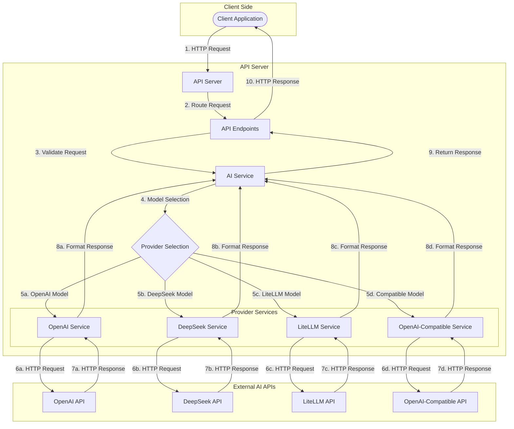

# AI API Server Boilerplates

This repository contains boilerplate code for AI API servers in both TypeScript and Python. These boilerplates provide a foundation for building API servers that interact with various AI providers such as OpenAI, DeepSeek, and LiteLLM.

## Workflow Diagram


```
┌─────────────────────────────────────────────────────────────────────────┐
│                             Client Side                                 │
│                                                                         │
│                        ┌────────────────────┐                           │
│                        │ Client Application │                           │
│                        └────────────────────┘                           │
│                                │                                        │
└────────────────────────────────┼────────────────────────────────────────┘
                                 │ 1. HTTP Request
                                 ▼
┌─────────────────────────────────────────────────────────────────────────┐
│                             API Server                                  │
│                                                                         │
│                        ┌─────────────────┐                              │
│                        │   API Server    │                              │
│                        └─────────────────┘                              │
│                                │                                        │
│                                │ 2. Route Request                       │
│                                ▼                                        │
│                        ┌─────────────────┐                              │
│                        │  API Endpoints  │                              │
│                        └─────────────────┘                              │
│                                │                                        │
│                                │ 3. Validate Request                    │
│                                ▼                                        │
│                        ┌─────────────────┐                              │
│                        │   AI Service    │                              │
│                        └─────────────────┘                              │
│                                │                                        │
│                                │ 4. Model Selection                     │
│                                ▼                                        │
│                        ┌─────────────────┐                              │
│                        │ProviderSelection│                              │
│                        └─────────────────┘                              │
│                          /      |      \      \                         │
│                         /       |       \      \                        │
│                        /        |        \      \                       │
│                       /         |         \      \                      │
│         5a. OpenAI   /   5b. DeepSeek     \ 5c. LiteLLM  \ 5d.Compatible│
│            Model    /       Model          \   Model      \    Model    │
│                    ▼                        ▼              ▼            ▼
│    ┌─────────────────┐  ┌─────────────────┐  ┌──────────────┐  ┌─────────────────┐
│    │ OpenAI Service  │  │ DeepSeek Service│  │LiteLLMService│  │CompatibleService│
│    └─────────────────┘  └─────────────────┘  └──────────────┘  └─────────────────┘
│           │                     │                   │                  │
└───────────┼─────────────────────┼───────────────────┼──────────────────┼──────────┘
            │                     │                   │                  │
            │ 6a. HTTP Request    │ 6b. HTTP Request  │ 6c. HTTP Request │ 6d. HTTP Request
            ▼                     ▼                   ▼                  ▼
┌─────────────────────────────────────────────────────────────────────────┐
│                           External AI APIs                              │
│                                                                         │
│    ┌─────────────────┐  ┌─────────────────┐  ┌─────────────┐  ┌─────────────────┐
│    │   OpenAI API    │  │  DeepSeek API   │  │ LiteLLM API │  │Compatible API   │
│    └─────────────────┘  └─────────────────┘  └─────────────┘  └─────────────────┘
│           │                     │                   │                  │
│           │ 7a. HTTP Response   │ 7b. HTTP Response │ 7c. HTTP Response│ 7d. HTTP Response
│           ▼                     ▼                   ▼                  ▼
└───────────┼─────────────────────┼───────────────────┼──────────────────┼──────────┘
            │                     │                   │                  │
┌───────────┼─────────────────────┼───────────────────┼──────────────────┼──────────┐
│           │                     │                   │                  │          │
│    ┌─────────────────┐  ┌─────────────────┐  ┌──────────────┐  ┌─────────────────┐│
│    │ OpenAI Service  │  │ DeepSeek Service│  │LiteLLMService│  │CompatibleService││
│    └─────────────────┘  └─────────────────┘  └──────────────┘  └─────────────────┘│
│           │                     │                   │                  │          │
│           │ 8a. Format Response │ 8b. FormatResponse│ 8c.FormatResponse│ 8d. Format Response│
│           │                     │                   │                  │          │
│           └─────────┬───────────┴───────────────────┴──────────────────┘          │
│                     │                                                             │
│                     ▼                                                             │
│             ┌─────────────────┐                                                   │
│             │   AI Service    │                                                   │
│             └─────────────────┘                                                   │
│                     │                                                             │
│                     │ 9. Return Response                                          │
│                     ▼                                                             │
│             ┌─────────────────┐                                                   │
│             │  API Endpoints  │                                                   │
│             └─────────────────┘                                                   │
│                     │                                                             │
└─────────────────────┼─────────────────────────────────────────────────────────────┘
                      │ 10. HTTP Response
                      ▼
             ┌─────────────────┐
             │ClientApplication│
             └─────────────────┘
```
The diagram above illustrates the workflow of the AI API server:
1. Client sends an HTTP request to the API server
2. The server routes the request to the appropriate endpoint
3. The endpoint validates the request and forwards it to the AI Service
4. The AI Service selects the appropriate provider based on the requested model
5. The selected provider service (OpenAI, DeepSeek, LiteLLM, or OpenAI-Compatible) is invoked
6. All provider services communicate with their respective external APIs using HTTP requests
7. The external APIs process the requests and return HTTP responses
8. The provider services format the responses into a standardized format
9. The formatted response is passed back through the AI Service
10. The response is returned to the client via the API endpoints

This architecture ensures that all external AI providers are accessed through a consistent interface, with all provider services using direct HTTP requests rather than SDK-specific implementations.

## Generated with LLM

Both the TypeScript and Python versions of these boilerplates were generated using Large Language Models (LLMs) with carefully crafted prompts. This approach allowed for rapid development of consistent, well-structured code across multiple programming languages.

### Prompts

You can find prompts here:
- [Python version](./prompts/python.md)
- [TypeScript version](./prompts/typescript.md)

## Features

- Support for multiple AI providers (OpenAI, DeepSeek, LiteLLM)
- Unified API for text completions
- Dynamic model discovery
- Environment-based configuration
- Error handling and logging
- API documentation
- Health check endpoints

## Available Versions

### Python Version

The Python version uses Flask for the web server and includes:
- Asynchronous service layer
- Pydantic for data validation
- Comprehensive error handling
- Environment-based configuration

### TypeScript Version

The TypeScript version uses Express for the web server and includes:
- TypeScript for type safety
- Modular architecture
- Environment-based configuration
- Comprehensive error handling

## Getting Started

Each boilerplate has its own README with specific instructions for setup and usage.

- [Python Boilerplate](./boilerplates/python/README.md)
- [TypeScript Boilerplate](./boilerplates/typescript/README.md)

## License

This project is open source and available under the ISC License.
