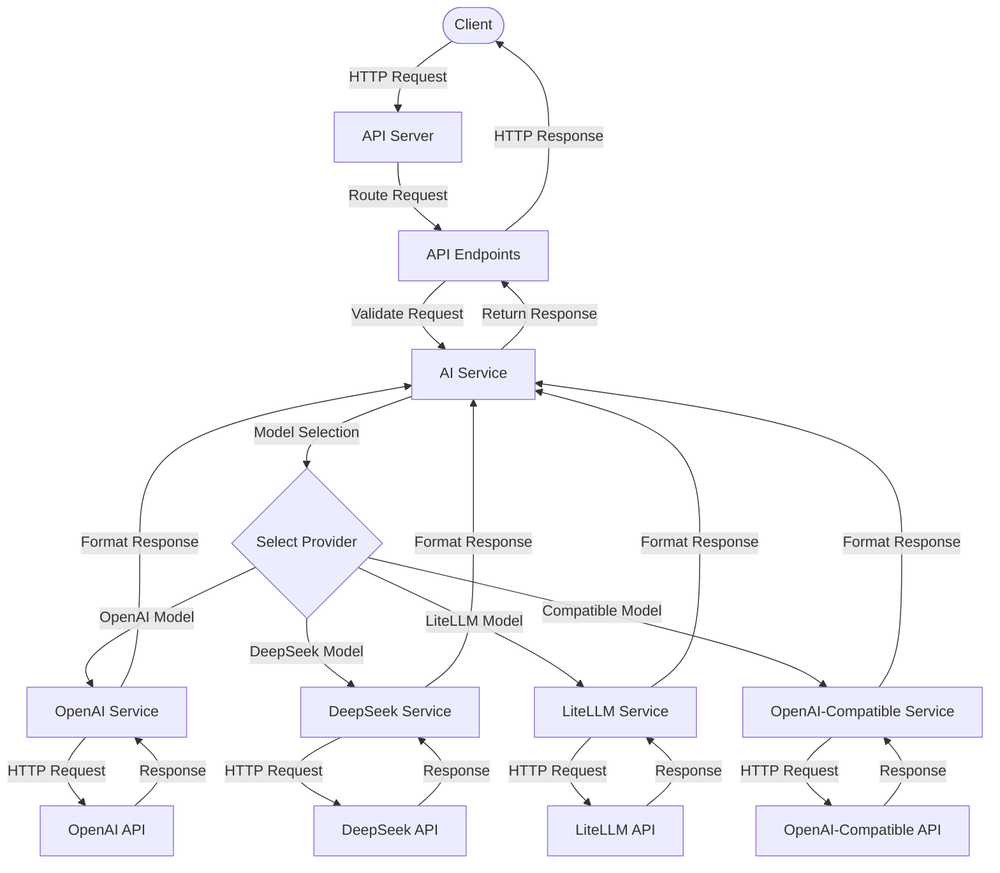

# AI API Server Boilerplates

This repository contains boilerplate code for AI API servers in both TypeScript and Python. These boilerplates provide a foundation for building API servers that interact with various AI providers such as OpenAI, DeepSeek, and LiteLLM.

## Workflow Diagram

The diagram above illustrates the workflow of the AI API server:
1. Client sends an HTTP request to the API server
2. The server routes the request to the appropriate endpoint
3. The endpoint validates the request and forwards it to the AI Service
4. The AI Service selects the appropriate provider based on the requested model
5. The provider service makes an HTTP request to the corresponding AI API
6. The API response is processed and formatted by the provider service
7. The formatted response is returned to the client

## Generated with LLM

Both the TypeScript and Python versions of these boilerplates were generated using Large Language Models (LLMs) with carefully crafted prompts. This approach allowed for rapid development of consistent, well-structured code across multiple programming languages.

### Prompts

You can find prompts here:
- [Python version](./prompts/python.md)
- [TypeScript version](./prompts/typescript.md)

## Features

- Support for multiple AI providers (OpenAI, DeepSeek, LiteLLM)
- Unified API for text completions
- Dynamic model discovery
- Environment-based configuration
- Error handling and logging
- API documentation
- Health check endpoints

## Available Versions

### Python Version

The Python version uses Flask for the web server and includes:
- Asynchronous service layer
- Pydantic for data validation
- Comprehensive error handling
- Environment-based configuration

### TypeScript Version

The TypeScript version uses Express for the web server and includes:
- TypeScript for type safety
- Modular architecture
- Environment-based configuration
- Comprehensive error handling

## Getting Started

Each boilerplate has its own README with specific instructions for setup and usage.

- [Python Boilerplate](./boilerplates/python/README.md)
- [TypeScript Boilerplate](./boilerplates/typescript/README.md)

## License

This project is open source and available under the MIT License.
